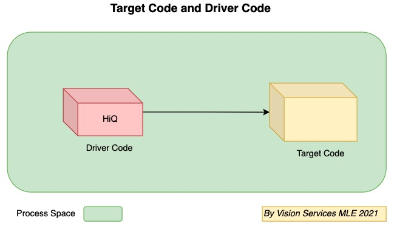

# HiQ - A Declarative, Non-intrusive, Dynamic, and Transparent Tracking System

HiQ is a `declarative`, `non-intrusive`, `dynamic` and `transparent` tracking system for both **monolithic** application and **distributed** system. It brings the runtime information tracking and optimization to a new level without compromising with speed and system performance, or hiding any tracking overhead information. HiQ applies for both I/O bound and CPU bound applications.

To explain the four features, **declarative** means you can declare the things you want to track in a text file, which could be a json, yaml or even csv,and no need to change program code. **Non-intrusive** means HiQ doesn't requires to modify original python code. **Dynamic** means HiQ supports tracing metrics featuring at run time, which can be used for adaptive tracing. **Transparent** means HiQ provides the tracing overhead and doesn't hide it no matter it is huge or tiny.

In addition to latency tracking, HiQ provides memory, disk I/O and Network I/O tracking out of the box. The output can be saved in form of normal line by line log file, or HiQ tree, or span graph.

## Environment

- Python 3.6+
- Linux, MacOS

## Installation

### Method 1 - build from source

git clone this repo and cd into the source code, and run:

```python
cd hiq && \
  python setup.py bdist_wheel && \
  pip install dist/hiq*.whl
```

### Method 2 - install with pip

```bash
pip install py-hiq
```


## Quick Start

To use HiQ, you need to have `target code` and `driver code`.



Let start with a simplest example by running HiQ against a monolithic application. The target code is `main.py`:

```python
import time

def func1():
    time.sleep(1.5)
    print("func1")
    func2()

def func2():
    time.sleep(2.5)
    print("func2")

def main():
    func1()

if __name__ == "__main__":
    main()
```

In this target code, there is a simple chain of function calls: `main()` -> `func1` -> `func2`. We can actually run the target code:

```python
cd examples
python main.py
```

And the output should be:

```
func1
func2
```

Now let's run the driver code, and if everything is fine, you should be able to see the output like this:


- Explanation of driver code

```python
import hiq


def run_main():
    driver = hiq.HiQLatency(
        hiq_table_or_path=[
            ["main", "", "main", "main"],
            ["main", "", "func1", "func1"],
            ["main", "", "func2", "func2"],
        ]
    )
    hiq.mod("main").main()
    driver.show()


if __name__ == "__main__":
    run_main()
```

Line 1: import python module `hiq`.  
Line 5-11: create an object of class `hiq.HiQLatency` and declare we want to trace function `main()`, `func1()`, `func2()` in `main.py`.  
Line 12: call function `main()` in `main.py`.  
Line 13: print HiQ trees.


For more advanced topics like `Log MonkeyKing`, `LumberJack`, `HiQ Distributed Tracing`, and `HiQ Service Mesh and K8S integration`, `HiQ vs cProfile/ZipKin/Jaeger/Skywalking`, please refer to the [official document](#).
