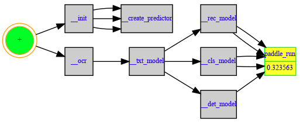
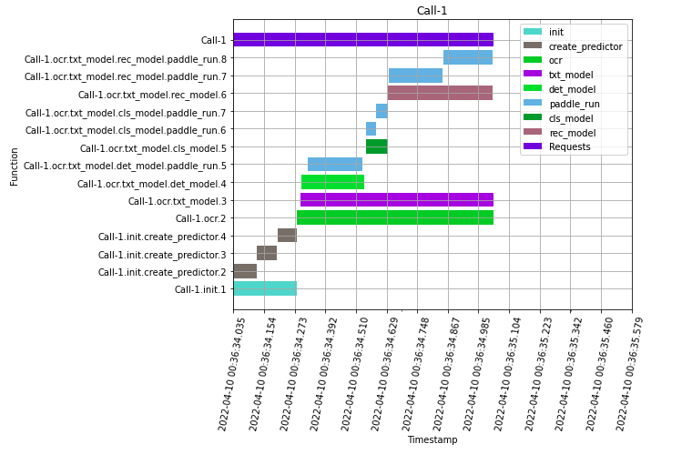

# Introduction To HiQ - A Modern Observability System

## Background and Theory

Software system information tracing is crucial to identify program performance bottlenecks, optimize the system, find bugs, operate and maintain the software system with confidence. It has been a common problem for years. We can categorize software system information tracing as offline and online tracing. By offline, it means the program runs once and exits in a relatively short period of time. By online, it means the program is long-running and is supposed to never go offline, such as a web service program.
 
For offline tracing, the existing tools have many drawbacks, including timing accuracy loss, high overhead, overwhelming irrelevant information, being difficult to customize and only useful for development purpose. Some examples are Python's `cProfile`, `profile`, `trace` libraries.
 
For online tracing, since Google published its Dapper paper in 2010, there have emerged many different implementations like Zipkin(2012), Jaeger(2016), and Apache SkyWalking(2018). Basically, to tackle the online tracing problem, the industry has two methods:
 
- The first traditional method, which is also called `explicit instrumentation`, requires developers to manually insert tracing code snippets into the original source code. This is an intrusive method so it cannot be used when modifying source code is not allowed or impossible.
 
- The second method is to use an agent thread to instrument the original code. When the program starts, in addition to the main thread, an agent thread is spawned to periodically trigger a thread dump and send the thread snapshot to the remote analytics server. The analytics server stores the information, consolidates them and reconstructs the runtime performance information for users to query. This is a non-intrusive method but it has several drawbacks. Firstly, reconstructing the runtime information from periodically generated thread snapshots creates `blind spots` for the tracing and monitoring system. Events with duration less than the thread dump interval will be missed completely. Secondly, the second method requires at least one more running thread and extra network I/O due to the frequent thread dump and communication between the client and analytics server. This incurs big overhead when the thread dump interval is small and when the application doesn't support multi-threading well. Thirdly, it assumes the target system is a long running service and requires complex setup, including data collection server, analytics server and web/UI server, which is an overkill for simple monolithic applications.
 
The existing technologies cannot meet our information tracing requirements in many cases. Sometimes, modifying the original code is not allowed due to various constraints. In some other cases, after tracing code is inserted into the original code, it inevitably has a negative impact on system performance, but the problem is how to quantitatively measure the impact. Furthermore, once the tracing code is written and running, another problem is, how can we tune or modify the tracing logic on the fly so that we can get the best system performance without losing insight of the system. To solve all the problems above, we developed a tracing system called `HiQ` which is declarative, non-intrusive, dynamic and transparent. The system has been open-sourced as a Python Library at Github: [here](https://github.com/oracle-samples/hiq).

## HiQ's Philosophy

Below is the first black hole image in history which NASA took in 2019. NASA brought observability to blackhole from outside, which tells us that we don't have to enter the black hole to observe it.

[](https://www.nasa.gov/mission_pages/chandra/news/black-hole-image-makes-history)

HiQ brings observability to our software system the same way. HiQ's philosophy is to **decouple `observability logic` from `business logic`**. It is a `declarative`, `non-intrusive`, `dynamic` and `transparent` tracking system for both **monolithic** application and **distributed** system. It brings the runtime information tracking and optimization to a new level without compromising with speed and system performance, or hiding any tracking overhead information. HiQ applies for both I/O bound and CPU bound applications.

To explain the four features, **declarative** means you can declare the things you want to track in a text file, which could be a json, yaml or even csv,and no need to change program code. **Non-intrusive** means HiQ doesn't requires to modify original python code. **Dynamic** means HiQ supports tracing metrics featuring at run time, which can be used for adaptive tracing. **Transparent** means HiQ provides the tracing overhead and doesn't hide it no matter it is huge or tiny.

In addition to latency tracking, HiQ provides memory, disk I/O and Network I/O tracking out of the box. The output can be saved in form of normal line by line log file, or HiQ tree, or span graph.

HiQ was originally developed to help our high-performance deep learning model serving, so it has good support for deep learning model development ecosystem such as onnxruntime, FastAPI, flask etc.

## Install HiQ

You can use the following command to install HiQ. At the time of this writing, the latest version is `1.1.14`.

```bash
pip install hiq-python
```

## Get Started

Let start with a simplest example by running HiQ against a simple monolithic python code [📄 `main.py`](hiq/examples/quick_start/main.py):

```python
# this is the main.py python source code
import time

def func1():
    time.sleep(1.5)
    print("func1")
    func2()

def func2():
    time.sleep(2.5)
    print("func2")

def main():
    func1()

if __name__ == "__main__":
    main()
```

In this code, there is a simple chain of function calls: `main()` -> `func1` -> `func2`.

Now we want to trace the functions without modifying its code. Let's run the following:


```python
git clone https://github.com/oracle/hiq.git
cd hiq/examples/quick_start
python main_driver.py
```

If everything is fine, you should be able to see the output like this:


From the screenshot we can see the timestamp and the latency of each function:


|   | main  | func1  |  func2 |  tracing overhead |
|---|---|---|---|---|
| latency(second)  | 4.0045  | 4.0044  | 2.5026  | 0.0000163  |


HiQ just traced the `main.py` file running without touching one line of its code.

To showcase HiQ's features, we have the following two examples for offline program and online web server respectively.

## Example 1 - Offline Tracing: Bring Observability to PaddleOCR

> The following `main.py` code is from PaddleOCR's official website [chinese-english-model-and-multilingual-model](https://github.com/PaddlePaddle/PaddleOCR/blob/release/2.4/doc/doc_en/quickstart_en.md#221-chinese--english-model-and-multilingual-model)

We have the following `main.py` code to do optical character recognition(OCR) for an image:

```python
import os
from paddleocr import PaddleOCR, draw_ocr
from PIL import Image

here = os.path.dirname(os.path.realpath(__file__))

def main():
    ocr = PaddleOCR(use_angle_cls=True, lang='en')
    img_path = f'{here}/img_12.jpg'
    result = ocr.ocr(img_path, cls=True, rec=True)
    image = Image.open(img_path).convert('RGB')
    boxes = [line[0] for line in result]
    txts = [line[1][0] for line in result]
    scores = [line[1][1] for line in result]
    im_show = draw_ocr(image, boxes, txts, scores, font_path=f'{here}/simfang.ttf')
    im_show = Image.fromarray(im_show)
    im_show.save('result.jpg')

if __name__ == "__main__":
    main()
```

This program use paddleocr to detect and recognize text from an image, render the text, and save to a new image. It will run perfectly, but it is a blackbox for us what happened inside the paddleocr package. To bring the observability to the black box, we just need to write a few lines of code. Create a file called `main_driver.py` and write code like:

```python
import hiq
from hiq.framework.paddleocr import PaddleOcrHiQLatency

driver = PaddleOcrHiQLatency()
hiq.mod("main").main()
driver.show()
```

Run it and you can get a HiQ tree like:

```
> python main_driver.py
[2022-04-10 00:36:34.035838 - 00:36:35.579645]  [100.00%] 🟢_root_time(1.5438)
                                                            [OH:1264us]
[2022-04-10 00:36:34.035838 - 00:36:34.414610]  [ 24.53%]    |___init(0.3788)
[2022-04-10 00:36:34.039819 - 00:36:34.174537]  [  8.73%]    |  |___create_predictor(0.1347)
[2022-04-10 00:36:34.175264 - 00:36:34.295924]  [  7.82%]    |  |___create_predictor(0.1207)
[2022-04-10 00:36:34.296169 - 00:36:34.414527]  [  7.67%]    |  l___create_predictor(0.1184)
[2022-04-10 00:36:34.414719 - 00:36:35.579645]  [ 75.46%]    l___ocr(1.1649)
[2022-04-10 00:36:34.435986 - 00:36:35.579396]  [ 74.06%]       l___txt_model(1.1434)
[2022-04-10 00:36:34.437172 - 00:36:34.809764]  [ 24.13%]          |___det_model(0.3726)
[2022-04-10 00:36:34.477088 - 00:36:34.800651]  [ 20.96%]          |  l_paddle_run(0.3236)
[2022-04-10 00:36:34.823408 - 00:36:34.951947]  [  8.33%]          |___cls_model(0.1285)
[2022-04-10 00:36:34.824346 - 00:36:34.879703]  [  3.59%]          |  |_paddle_run(0.0554)
[2022-04-10 00:36:34.880924 - 00:36:34.951756]  [  4.59%]          |  l_paddle_run(0.0708)
[2022-04-10 00:36:34.952928 - 00:36:35.573461]  [ 40.19%]          l___rec_model(0.6205)
[2022-04-10 00:36:34.958261 - 00:36:35.279094]  [ 20.78%]             |_paddle_run(0.3208)
[2022-04-10 00:36:35.282499 - 00:36:35.572746]  [ 18.80%]             l_paddle_run(0.2902)
```

We can see the details of the PaddleOCR model running latencies. Recognition model took most of the time because it ran twice and it is slow for each paddle_run. Detection model is not fast either, since one paddle_run took 20.96% of the total running time.

You can also save the HiQ tree as a call graph with max-latency node in yellow color

```python
from hiq import KEY_LATENCY
from IPython.display import Image
t = driver.get_metrics(metrics_key=KEY_LATENCY)[0]
Image(t.to_img())
```




Or you can save HiQ tree as a Gantt Chart with below code:

```
from hiq.utils import create_gantt_chart_time
create_gantt_chart_time(t.repr())
```



You can see the jupyter notebook at [here](https://github.com/oracle/hiq/blob/main/hiq/examples/paddle/demo.ipynb).


## Example 2 - Online Tracing: Bring Observability to FastAPI in Production

HiQ provides an integrated UI for the popular Python web framework like FastAPI, Flask etc. In Example 2, we will demo how to trace FastAPI web server which is widely used to serve machine learning models in practice.

You can find the corresponding code at [here](https://github.com/oracle-samples/hiq/tree/main/hiq/examples/fastapi).

`webapp.py` is the original web server code to serve an AlexNet onnx model with FastAPI. And the dirver code is `webapp_driver.py`.

To trace the latency, we can run `python webapp_driver.py`:

```
> python webapp_driver.py
INFO:     Started server process [16618]
INFO:     Waiting for application startup.
INFO:     Application startup complete.
INFO:     Uvicorn running on http://0.0.0.0:8080 (Press CTRL+C to quit)
```

Open the link `http://localhost:8080/hiq` in your browser, and you will see something like this page:


Click the `API` link under the bold text HIQ in the page, and you can see the swagger UI for the web server. You can try out the `/predict` endpoint to send some requests.

In the response header part, you can see something like:

```
 access-control-expose-headers: X-Request-ID
 content-length: 23
 content-type: application/json
 date: Mon,06 Feb 2023 19:55:44 GMT
 server: uvicorn
 x-latency: 0.15682927519083023
 x-request-id: fe0a322299874deeb811b0cdb9ac55a5
```

By default, HiQ will generate a unique `x-request-id` for each request. It will put the endpoint latency in `x-latency` field. You can also customize the field name to suit your need for sure.

Then you can go back to the HiQ page(http://localhost:8080/hiq), and click the req ID in the Latency table. You would see something like:


This gives you the text graph of the HiQ tree.

In our testing, the latency overhead of HiQ tracing is less than 0.1% so negligible. With HiQ, we bring the observability to production without sacrificing the latency.

----

There are many features such as `Dynamic Tracing`, `Memory Tracing`, `Disk/System/Network I/O Tracing` supported by HiQ. You can also integreate `HiQ` into existing observability solutions like `Prometheus`, `OpenTelemetry`, `Jaeger`, `ZipKin`, `OCI APM`, `OCI Functions` and `OCI Streaming`. For the details, please refer to the online document [here](https://hiq.readthedocs.io/en/latest/index.html) and its PDF version [here](https://github.com/oracle-samples/hiq/blob/main/hiq/docs/hiq.pdf).


