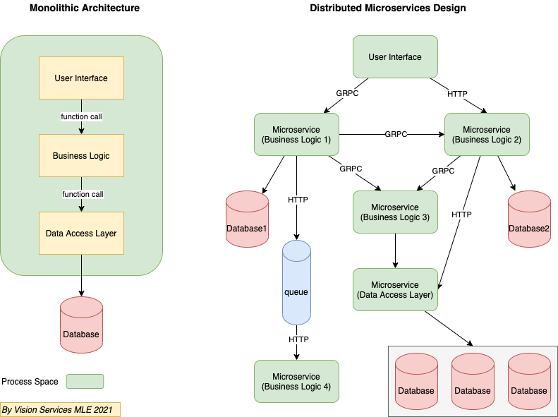

# HiQ Background

HiQ is a library for software performance tracing, monitoring and optimization.

## Monolithic Application vs. Distributed System and Microservice Architecture

### What is a monolithic architecture?

It's a traditional approach to software development in which the entire system function is based on a single application as a single, autonomous unit. A helpful analogy here would be a large block of stone (a.k.a monolith). In software development, this single block would stand for a single platform.

In a monolithic app, all functions are managed and served in one place. Of course, an app has its inner structure consisting of a database, client-side interface, business logic, but it still remains an indivisible unit. Its components don’t require API to communicate.

### What is a distributed/microservice architecture?

In a microservice architecture, business logic is broken down into lightweight, single-purpose self-sufficient services. As such, the infrastructure is akin to collection modules. Each service within this type of architecture is responsible for a specific business goal. In essence, the microservice architecture looks like a Lego construction, which can be decomposed into a number of modules. The interaction between the components of the system ensured by means of API.

## Monitoring and Observability

**Monitoring** is tooling or a technical solution that allows teams to watch and understand the state of their systems. Monitoring is based on gathering predefined sets of metrics or logs.

**Observability** is tooling or a technical solution that allows teams to actively debug their system. Observability is based on exploring properties and patterns not defined in advance.

### Blackbox monitoring

In a blackbox (or synthetic) monitoring system, input is sent to the system under examination in the same way a customer might. This might take the form of HTTP calls to a public API, or RPC calls to an exposed endpoint, or it might be calling for an entire web page to be rendered as a part of the monitoring process.

Blackbox monitoring is a `sampling-based method`. The same system that is responsible for user requests is monitored by the blackbox system. A blackbox system can also provide coverage of the target system's surface area. This could mean probing each external API method. You might also consider a representative mixture of requests to better mimic actual customer behavior. For example, you might perform 100 reads and only 1 write of a given API.

You can govern this process with a scheduling system, to ensure that these inputs are made at a sufficient rate in order to gain confidence in their sampling. Your system should also contain a validation engine, which can be as simple as checking response codes, or matching output with regular expressions, up to rendering a dynamic site in a headless browser and traversing its DOM tree, looking for specific elements. After a decision is made (pass, fail) on a given probe, you must store the result and metadata for reporting and alerting purposes. Examining a snapshot of a failure and its context can be invaluable for diagnosing an issue.

### Whitebox Monitoring

Monitoring and observability rely on signals sent from the workload under scrutiny into the monitoring system. This can generally take the form of the three most common components: `metrics`, `logs`, and `traces`. Some monitoring systems also track and report events, which can represent user interactions with an entire system, or state changes within the system itself.

**Metrics** are simply measurements taken inside a system, representing the state of that system in a measurable way. These are almost always numeric and tend to take the form of counters, distributions, and gauges. There are some cases where string metrics make sense, but generally numeric metrics are used due to the need to perform mathematical calculations on them to form statistics and draw visualizations.

**Logs** can be thought of as append-only files that represent the state of a single thread of work at a single point in time. These logs can be a single string like "User pushed button X" or a structured log entry which includes metadata such as the time the event happened, what server was processing it, and other environmental elements. Sometimes a system which cannot write structured logs will produce a semi-structured string like `[timestamp] [server] message [code]` which can be parsed after the fact, as needed. Log processing can be a very reliable method of producing statistics that can be considered trustworthy, as they can be reprocessed based on immutable stored logs, even if the log processing system itself is buggy. Additionally, logs can be processed in real time to produce log-based metrics. In HiQ, **LMK** (LogMonkeyKing) is used to write the log entry.

**Traces** are often used in distributed system. **Traces** are composed of *spans*, which are used to follow an event or user action through a distributed system. A span can show the path of a request through one server, while another span might run in parallel, both having the same parent span. These together form a trace, which is often visualized in a *waterfall graph* similar to those used in profiling tools. This lets developers understand time taken in a system, across many servers, queues, and network hops. A common framework for this is **OpenTelemetry**, which was formed from both OpenCensus and OpenTracing. OpenTelemetry defines interface, but the implementations are in the specific software like `Zipkin`, `Jaeger`, or `Apache Skywalking`.

Metrics, logs, and traces can be reported to the monitoring system by the server under measurement, or by an adjacent agent that can witness or infer things about the system.

### Instrumentation

To make use of a monitoring system, your system must be instrumented. In some cases, code need to be added to a system in order to expose its inner state. For example, if a simple program contains a pool of connections to another service, you might want to keep track of the size of that pool and the number of unused connections at any given time. In order to do so, a developer must write some code in the connection pool logic to keep track of when connections are formed or destroyed, when they are handed out, and when they are returned. This might take the form of log entries or events for each of these, or you might increment and decrement the metric for the size of the queue, or you might increment an absolute metric called *connection_number* each time a connection is created, or each time a pool is expanded. In other cases, like when you are using `HiQ`, you don't have to explicit instrument your code. HiQ will implicitly instrument your code without touching the target code.

## Metrics

Metrics can be categorized into two types: **business metrics** and **system metrics**. Business metrics are quantified measures relavent to business logic and normally used to make business decision. System metrics are quantitative measures of the software system, such as latency, memory, CPU load, disk I/O, network I/O. HiQ is able to handle both metrics.

In monitoring and observability context, metrics, from another perspective, can be categorize into different types. Different software or organizations have different ways, for instance, GCP use 3 types way and they call it `Kind` instead of `type `, Prometheus uses 4 types. In HiQ, we only use two types only: **abs metric** and **delta metric**.

### Abs

A *abs* metric, in which the value measures a specific instant in time. For example, metrics measuring CPU utilization are absolute metrics; each point records the CPU utilization at the time of measurement. Some other examples of a absolute metric are the current temperature, current time, and current memory resident set size.

### Delta

A *delta* metric, aka relative metric, in which the value measures the change since it was last recorded. For example, metrics measuring request counts are delta metrics; each value records how many requests were received since the last data point was recorded. The delta is always the end value minus start value. Please be noted delta metric could be **negative**. Some other examples of a delta metric are the latency, memory cost, and network I/O traffic.

> Compared with Google and Prometheus' definition, HiQ abs metric is equivalent to Google and Prometheus's gauge metric, and HiQ's delta metric is equivalent to Google's delta and cumulative metrics and Prometheus's counter.

| HiQ   | Google            | Prometheus |
| ----- | ----------------- | ---------- |
| abs   | gauge             | gauge      |
| delta | delta, cumulative | counter    |

Ref:

- https://prometheus.io/docs/concepts/metric_types/
- https://cloud.google.com/monitoring/api/v3/kinds-and-types#metric-kinds

## Application Performance Monitoring

**APM** (Application Performance Monitoring) provides a comprehensive set of features to monitor applications and diagnose performance issues. It has a very long history and covers very broad areas like including hardware performance monitoring. Although the name has word *monitoring* inside, it is more like an observability tool. It has become a profitable business for many companies and used frequently in sales and marketing context, like this one: [Application Performance Monitoring Tools Reviews 2021](https://www.gartner.com/reviews/market/application-performance-monitoring) by Gartner. In early times, APM is more for monolitic applications, but now it has expanded to distributed systems.

## Distributed Tracing

Distributed tracing, sometimes called distributed request tracing, is a method to monitor applications built on a [microservices architecture](https://www.splunk.com/en_us/data-insider/what-are-microservices.html).

IT and DevOps teams use distributed tracing to follow the course of a request or transaction as it travels through the application that is being monitored. This allows them to pinpoint bottlenecks, bugs, and other issues that impact the application’s performance.

In 2010, Google put online a paper, [Dapper, a Large-Scale Distributed Systems Tracing Infrastructure](https://research.google/pubs/pub36356/), which starts the new era of distributed tracing. 2019 started with the merge of OpenTracing and OpenCensus into [OpenTelemetry](https://opentelemetry.io/), so that the industry started to have a unified standard for distributed tracing. Now all APM vendors provide distributed tracing features.
