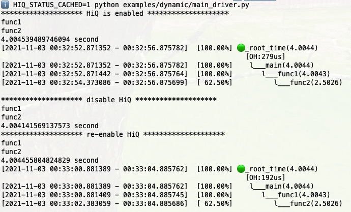

# HiQ Tracing Tutorial

Latency tracing is always enabled as long as global HiQ status is on. Other than latency, HiQ provides memory, disk I/O, network I/O, and Exception tracing out of the box.

## Global HiQ Status

Global HiQ status is a cross-process boolean value that decide if HiQ running in the current machine is enabled or not. There are two functions to get and set the global HiQ status. You can get them from:

```python
from hiq.hiq_utils import get_global_hiq_status, set_global_hiq_status
```

The following is the demo code:

```eval_rst
.. literalinclude:: ../../examples/hiq_global_status/demo.py
   :language: python
   :linenos:
```

Run it and you will get:

```
ℹ️  python examples/hiq_global_status/demo.py
😇 set global hiq to True
True
😇 set global hiq to False
False
```

If global HiQ status is False, all the HiQ in the machine is disabled. If it is True, you can call `disable()` to disable a specific HiQ Object. This is so-called `dynamic tracing`.

```eval_rst
.. note::

   We assume global HiQ status is already set to `True` in this tutorial.
```

Normally you don't have to call them directly. Instead you use context manager `hiq.HiQStatusContext()` to make sure the HiQ status is on or off.


```eval_rst

  .. autoclass:: hiq.HiQStatusContext

      .. automethod:: __init__

.. tip::

   `hiq.HiQStatusContext()` is the best practice to use whenever possible.
```


## Dynamic Tracing

HiQ tracing is dynamic, which means you can enable and disable it as needed. The following is a simple example.

You can disable and enable HiQ tracing at run time.

```eval_rst
.. literalinclude:: ../../examples/dynamic/main_driver.py
   :language: python
   :linenos:
```

With this code above, we disable and enable HiQ tracing, and run the `main()` function. The result is like:



The environment variable `HIQ_STATUS_CACHED` decide if the result is cached. If it is enabled, the result will be cached for `5 seconds`.
## Metrics Customization

HiQ supports metrics customization. You can choose to trace different metrics in HiQ tree.

### ExtraMetrics

Now HiQ supports 3 types of customized metrics: `ExtraMetrics.FILE`, `ExtraMetrics.FUNC`, `ExtraMetrics.ARGS`. You can pass them in a set object to `extra_metrics` in the constructor like below. And of course, different metrics have different latency overheads, which you can find in HiQ tree as well.

Target Code:

```eval_rst
.. literalinclude:: ../../examples/extra/simple/main.py
   :language: python
   :linenos:
```

Driver Code:

```eval_rst
.. literalinclude:: ../../examples/extra/simple/main_driver.py
   :language: python
   :linenos:
```

```eval_rst
.. note::

   If we create one more driver for the same target, we need to disable the previous driver by calling `driver.disable_hiq()`, otherwise an exception will be raised.
```

Run this file and the output will be like:

```
ℹ️  python examples/extra/simple/main_driver.py
[2021-11-07 19:46:47.464262 - 19:46:51.476240]  [100.00%] 🟢_root_time(4.0120)
                                                            [OH:38767us]
[2021-11-07 19:46:47.464262 - 19:46:51.476240]  [100.00%]    l___main(4.0120) ({'file': 'examples/extra/simple/main_driver.py:10'})
[2021-11-07 19:46:47.466069 - 19:46:51.476229]  [ 99.95%]       l___func1(4.0102) ({'file': 'examples/extra/simple/main.py:14'})
[2021-11-07 19:46:48.973780 - 19:46:51.476187]  [ 62.37%]          l___func2(2.5024) ({'file': 'examples/extra/simple/main.py:6'})

[2021-11-07 19:46:51.478223 - 19:46:55.488515]  [100.00%] 🟢_root_time(4.0103)
                                                            [OH:6217us]
[2021-11-07 19:46:51.478223 - 19:46:55.488515]  [100.00%]    l___main(4.0103) ({'function': 'run_main'})
[2021-11-07 19:46:51.480468 - 19:46:55.488504]  [ 99.94%]       l___func1(4.0080) ({'function': 'main'})
[2021-11-07 19:46:52.985900 - 19:46:55.488467]  [ 62.40%]          l___func2(2.5026) ({'function': 'func1'})

[2021-11-07 19:46:55.490225 - 19:46:59.494639]  [100.00%] 🟢_root_time(4.0044)
                                                            [OH:212us]
[2021-11-07 19:46:55.490225 - 19:46:59.494639]  [100.00%]    l___main(4.0044) ({'args': '[int](1),[int](2)'})
[2021-11-07 19:46:55.490282 - 19:46:59.494629]  [100.00%]       l___func1(4.0043) ({'args': '[int](1),[int](2)'})
[2021-11-07 19:46:56.992013 - 19:46:59.494591]  [ 62.50%]          l___func2(2.5026) ({'args': '[int](2)'})

[2021-11-07 19:46:59.496759 - 19:47:03.512220]  [100.00%] 🟢_root_time(4.0155)
                                                            [OH:9936us]
[2021-11-07 19:46:59.496759 - 19:47:03.512220]  [100.00%]    l___main(4.0155) ({'args': '[int](1),[int](2)', 'file': 'examples/extra/simple/main_driver.py:28', 'function': 'run_main'})
[2021-11-07 19:46:59.500252 - 19:47:03.512210]  [ 99.91%]       l___func1(4.0120) ({'args': '[int](1),[int](2)', 'file': 'examples/extra/simple/main.py:14', 'function': 'main'})
[2021-11-07 19:47:01.010409 - 19:47:03.512170]  [ 62.30%]          l___func2(2.5018) ({'args': '[int](2)', 'file': 'examples/extra/simple/main.py:6', 'function': 'func1'})
```

We can see when we enable `ExtraMetrics.FILE`, the file path and number name will be attached to the tree node. When we enable `ExtraMetrics.FUNC`, the caller function name will be attached to the tree node. When we enable `ExtraMetrics.ARGS`, the function argument type and value will be attached to the tree node. If we enable all of them, all the information will be attached, but we got the largest latency overhead.

### Complex Data Type

Target Code:

```eval_rst
.. literalinclude:: ../../examples/extra/complex/main.py
   :language: python
   :linenos:
```

Driver Code:

```eval_rst
.. literalinclude:: ../../examples/extra/complex/main_driver.py
   :language: python
   :linenos:
```

Run this file and the output will be like:

```
ℹ️  python examples/extra/complex/main_driver.py
[2021-11-07 19:51:05.408034 - 19:51:09.412475]  [100.00%] 🟢_root_time(4.0044)
                                                            [OH:260us]
[2021-11-07 19:51:05.408034 - 19:51:09.412475]  [100.00%]    l___main(4.0044) ({'args': '[tensor](torch.Size([2000, 3])),[ndarry]((3, 2000)),[pandas]((100, 4)),[list<int>](3),[bytes](3)', 'kwargs': '{\'st\': \'[set](3)\', \'dt\': "[dict]([\'a\'])", \'pd_time\': \'[DatetimeIndex](1827)\'}'})
[2021-11-07 19:51:05.408108 - 19:51:09.412463]  [100.00%]       l___func1(4.0044) ({'args': '[tensor](torch.Size([2000, 3])),[ndarry]((3, 2000)),[pandas]((100, 4))'})
[2021-11-07 19:51:06.909852 - 19:51:09.412425]  [ 62.49%]          l___func2(2.5026) ({'args': '[ndarry]((3, 2000))'})
```

HiQ can handle all python built in types and third-party module' types including Pytorch tensor, Numpy NDArray, Pandas DataFrame and Series.

### Large Data Structure

Tracing large data structure like arrays could be a performance killer. It will take a lot of CPU and some memory as well, and slow down the program. So this section is only recommended for use case where performance requirement is not that critical.

By default, HiQ trace the type and value of function arguments. For composite data structures, it traces the type and `size` instead of value. But sometimes, you may really need to know the data no matter how big it is. In this case, you can pass your own function arguments handler When creating HiQ Tracing Object.

With the same target code as above, we can have this driver code to save large data to hard disk:

```eval_rst
.. literalinclude:: ../../examples/extra/large/main_driver.py
   :language: python
   :emphasize-lines: 14-23, 35
   :linenos:
```

Run the code and we'll get something like:
```
[2021-11-08 00:17:23.378755 - 00:17:27.383362]  [100.00%] 🟢_root_time(4.0046)
                                                            [OH:8027us]
[2021-11-08 00:17:23.378755 - 00:17:27.383362]  [100.00%]    l___main(4.0046) ({'args': '...', 'kwargs': '...'})
[2021-11-08 00:17:23.378954 - 00:17:27.383350]  [ 99.99%]       l___func1(4.0044) ({'args': '[tensor](torch.Size([2000, 3])),[ndarry]((3, 2000)),[pandas]((100, 4))'})
[2021-11-08 00:17:24.880710 - 00:17:27.383292]  [ 62.49%]          l___func2(2.5026) ({'args': '[ndarry]((3, 2000))'})
```
The argument `df` has been saved into a file. To verify it:

```
ℹ️  cat /tmp/main.args.log |wc -l
100
```

The output 100 matches the row number 100 in line 29.

The entire `kwargs` has been pickled into `/tmp/main.args.pkl`. To verify the values:

```python
>>> import pickle
>>> x = pickle.load(open('/tmp/main.args.pkl','rb'))
>>> x
{'st': {5, 6, 7}, 'dt': {'a': 1}, 'pd_time': DatetimeIndex(['2016-01-01', '2016-01-02', '2016-01-03', '2016-01-04',
               '2016-01-05', '2016-01-06', '2016-01-07', '2016-01-08',
               '2016-01-09', '2016-01-10',
               ...
               '2020-12-22', '2020-12-23', '2020-12-24', '2020-12-25',
               '2020-12-26', '2020-12-27', '2020-12-28', '2020-12-29',
               '2020-12-30', '2020-12-31'],
               dtype='datetime64[ns]', length=1827, freq='D')}
```

## Memory Tracing

```eval_rst
.. literalinclude:: ../../examples/memory/main_driver.py
   :language: python
   :emphasize-lines: 9-12
   :linenos:
```

Output:

```
ℹ️  python examples/memory/main_driver.py
func1
func2
[     19.457 -      19.461]  [100.00%] 🟢_root_get_memory_mb(0.0039)
[     19.457 -      19.461]  [100.00%]    l___main(0.0039)
```

The memory here means RSS memory. From the example above, we can see the memory is increased from 19.457MB to 19.461MB before and after the main function invocation. And the two functions `func1` and `func2` don't consume extra memory because we don't see them in the output. The reason why we don't see them is they are `zero span node`.

### Timestamp With Non-latency Metrics

Unlike the latency metrics, memory is not related to time, so we don't see any timestamp in above output, which is not convenient for our debugging. For non-latency metrics, to get timestamp in the output, we should add `attach_timestamp=True` in `hiq.HiQMemory`'s constructor.


```eval_rst
.. note::

   This works for all non-latency metrics like memory, disk I/O, network I/O etc.
```


```eval_rst
.. literalinclude:: ../../examples/memory/main_driver2.py
   :language: python
   :emphasize-lines: 10
   :linenos:
```

The result becomes:
```
$ python examples/memory/main_driver2.py
func1
func2
                                   [     219.582 -      219.590]  [100.00%] 🟢_root_get_memory_mb(0.0078)
[1636877696.769 - 1636877700.774]  [     219.582 -      219.590]  [100.00%]    l___main(0.0078)
```

We can change the date time format by specify `time_format=FORMAT_DATETIME` in the `show` function. The new driver code is like:

```eval_rst
.. literalinclude:: ../../examples/memory/main_driver3.py
   :language: python
   :emphasize-lines: 10, 12
   :linenos:
```

In the new output below, we can see the datetime time format has changed:
```
$ python examples/memory/main_driver3.py
func1
func2
                                                [    219.500 -     219.508]  [100.00%] 🟢_root_get_memory_mb(0.0078)
[2021-11-14 08:18:02.419058 - 08:18:06.423343]  [    219.500 -     219.508]  [100.00%]    l___main(0.0078)
```
## Disk I/O Tracing


Target Code:

```eval_rst
.. literalinclude:: ../../examples/io_disk/main.py
   :language: python
   :linenos:
```

Driver Code:

```eval_rst
.. literalinclude:: ../../examples/io_disk/main_driver.py
   :language: python
   :linenos:
```

Run the driver code and get the output:

```
ℹ️  python hiq/examples/io_disk/main_driver.py
🥰 read file size: 3072 bytes
🥰 read file size: 2048 bytes
[2021-11-03 22:45:37.416571 - 22:45:44.432328]  [100.00%] 🟢_root_time(7.0158)
                                                            [OH:552us]
[2021-11-03 22:45:37.416571 - 22:45:44.432328]  [100.00%]    l___main(7.0158)
[2021-11-03 22:45:37.416641 - 22:45:44.432315]  [100.00%]       l___f1(7.0157)
[2021-11-03 22:45:39.418850 - 22:45:41.424977]  [ 28.59%]          |___cr(2.0061)
[2021-11-03 22:45:41.424852 - 22:45:41.424904]  [  0.00%]          |  l___dio_r(0.0001)
[2021-11-03 22:45:41.425046 - 22:45:44.432301]  [ 42.86%]          l___f2(3.0073)
[2021-11-03 22:45:42.426265 - 22:45:44.432281]  [ 28.59%]             l___cr(2.0060)
[2021-11-03 22:45:44.432160 - 22:45:44.432212]  [  0.00%]                l___dio_r(0.0001)

[   0.000 - 5120.000]  [100.00%] 🟢_root_get_io_bytes_r(5120.0000)
[   0.000 - 5120.000]  [100.00%]    l___main(5120.0000)
[   0.000 - 5120.000]  [100.00%]       l___f1(5120.0000)
[   0.000 - 3072.000]  [ 60.00%]          |___cr(3072.0000)
[   0.000 - 3072.000]  [ 60.00%]          |  l___dio_r(3072.0000)
[3072.000 - 5120.000]  [ 40.00%]          l___f2(2048.0000)
[3072.000 - 5120.000]  [ 40.00%]             l___cr(2048.0000)
[3072.000 - 5120.000]  [ 40.00%]                l___dio_r(2048.0000)
```


## System I/O Tracing

The following target code creates a 3KB file in `fun1()` and a 2KB file in `fun2()` and then use `os.read`, which invokes linux system call `read()`, to read 50 bytes through file descriptor. HiQ can trace the I/O traffic of linux system call `read()` and `write()`.

Target Code:

```eval_rst
.. literalinclude:: ../../examples/io_sys/main.py
   :language: python
   :linenos:
```

We can trace the system I/O by adding `HIQ_TABLE_SIO_RD` for read or `HIQ_TABLE_SIO_WT` for write. The following is the driver code:

```eval_rst
.. literalinclude:: ../../examples/io_sys/main_driver.py
   :language: python
   :linenos:
```

Run the driver code and get the output:

```
ℹ️  python examples/io_sys/main_driver.py
[2021-11-04 02:56:27.995306 - 02:56:35.008258]  [100.00%] 🟢_root_time(7.0130)
                                                            [OH:896us]
[2021-11-04 02:56:27.995306 - 02:56:35.008258]  [100.00%]    l___main(7.0130)
[2021-11-04 02:56:27.995369 - 02:56:35.008245]  [100.00%]       l___f1(7.0129)
[2021-11-04 02:56:29.997583 - 02:56:32.002374]  [ 28.59%]          |___cr(2.0048)
[2021-11-04 02:56:32.001401 - 02:56:32.001539]  [  0.00%]          |  |___sio_r(0.0001)
[2021-11-04 02:56:32.002117 - 02:56:32.002136]  [  0.00%]          |  |___sio_r(0.0000)
[2021-11-04 02:56:32.002340 - 02:56:32.002354]  [  0.00%]          |  l___sio_r(0.0000)
[2021-11-04 02:56:32.002420 - 02:56:35.008234]  [ 42.86%]          l___f2(3.0058)
[2021-11-04 02:56:33.003664 - 02:56:35.008218]  [ 28.58%]             l___cr(2.0046)
[2021-11-04 02:56:35.007247 - 02:56:35.007400]  [  0.00%]                |___sio_r(0.0002)
[2021-11-04 02:56:35.007963 - 02:56:35.007983]  [  0.00%]                |___sio_r(0.0000)
[2021-11-04 02:56:35.008180 - 02:56:35.008200]  [  0.00%]                l___sio_r(0.0000)

[0.000  - 100.000]  [100.00%] 🟢_root_get_sio_bytes_r(100.0000)
[0.000  - 100.000]  [100.00%]    l___main(100.0000)
[0.000  - 100.000]  [100.00%]       l___f1(100.0000)
[0.000  -  50.000]  [ 50.00%]          |___cr(50.0000)
[0.000  -  50.000]  [ 50.00%]          |  l___sio_r(50.0000)
[50.000 - 100.000]  [ 50.00%]          l___f2(50.0000)
[50.000 - 100.000]  [ 50.00%]             l___cr(50.0000)
[50.000 - 100.000]  [ 50.00%]                l___sio_r(50.0000)
```


## Network I/O Tracing

Target Code:

```eval_rst
.. literalinclude:: ../../examples/io_network/main.py
   :language: python
   :linenos:
```

In `func4()`, when global variable `count` is equal to 3, it will download an image from the internet.


```eval_rst
.. thumbnail:: img/hardwood-tree.jpg
   :width: 300px
   :height: 300px
   :align: center
```


The image size is 199602 bytes as displayed below:

```
-rw-rw-r-- 1 ubuntu ubuntu 199602 May 13  2018 hardwood-tree.jpg
```

Driver Code:

```eval_rst
.. literalinclude:: ../../examples/io_network/main_driver.py
   :language: python
   :emphasize-lines: 15
   :linenos:
```

Notice at line 15, we added a new line to track network ingress I/O. To track the egress traffic, you just need to replace `TAU_TABLE_NIO_GET` with `TAU_TABLE_NIO_WRT`.

Output:
```
[2021-11-03 08:25:53.510876 - 08:25:57.561308]  [100.00%] 🟢_root_time(4.0504)
                                                            [OH:2074us]
[2021-11-03 08:25:53.510876 - 08:25:57.561308]  [100.00%]    l___main(4.0504)
[2021-11-03 08:25:53.861402 - 08:25:57.160576]  [ 81.45%]       |___func4(3.2992)
[2021-11-03 08:25:54.183760 - 08:25:56.940055]  [ 68.05%]       |  |___func2(2.7563)
[2021-11-03 08:25:54.283967 - 08:25:56.940045]  [ 65.58%]       |  |  l___func1(2.6561)
[2021-11-03 08:25:54.284018 - 08:25:56.940032]  [ 65.57%]       |  |     l___func4(2.6560)
[2021-11-03 08:25:54.484393 - 08:25:56.719469]  [ 55.18%]       |  |        |___func2(2.2351)
[2021-11-03 08:25:54.584729 - 08:25:56.719449]  [ 52.70%]       |  |        |  l___func1(2.1347)
[2021-11-03 08:25:54.584799 - 08:25:56.719430]  [ 52.70%]       |  |        |     l___func4(2.1346)
[2021-11-03 08:25:54.785170 - 08:25:56.498725]  [ 42.31%]       |  |        |        |___func2(1.7136)
[2021-11-03 08:25:54.885402 - 08:25:56.498709]  [ 39.83%]       |  |        |        |  l___func1(1.6133)
[2021-11-03 08:25:54.885453 - 08:25:56.498696]  [ 39.83%]       |  |        |        |     l___func4(1.6132)
[2021-11-03 08:25:54.885522 - 08:25:54.906254]  [  0.51%]       |  |        |        |        |___nio_get(0.0207)
[2021-11-03 08:25:55.106743 - 08:25:56.278137]  [ 28.92%]       |  |        |        |        |___func2(1.1714)
[2021-11-03 08:25:55.206995 - 08:25:56.278122]  [ 26.44%]       |  |        |        |        |  l___func1(1.0711)
[2021-11-03 08:25:55.207054 - 08:25:56.278107]  [ 26.44%]       |  |        |        |        |     l___func4(1.0711)
[2021-11-03 08:25:55.407383 - 08:25:56.057437]  [ 16.05%]       |  |        |        |        |        |___func2(0.6501)
[2021-11-03 08:25:55.507616 - 08:25:56.057420]  [ 13.57%]       |  |        |        |        |        |  l___func1(0.5498)
[2021-11-03 08:25:55.507676 - 08:25:56.057403]  [ 13.57%]       |  |        |        |        |        |     l___func4(0.5497)
[2021-11-03 08:25:55.708037 - 08:25:55.836658]  [  3.18%]       |  |        |        |        |        |        |___func2(0.1286)
[2021-11-03 08:25:55.808240 - 08:25:55.836573]  [  0.70%]       |  |        |        |        |        |        |  l___func1(0.0283)
[2021-11-03 08:25:55.836824 - 08:25:56.057387]  [  5.45%]       |  |        |        |        |        |        l___func3(0.2206)
[2021-11-03 08:25:55.957082 - 08:25:56.057372]  [  2.48%]       |  |        |        |        |        |           l___func2(0.1003)
[2021-11-03 08:25:56.057324 - 08:25:56.057343]  [  0.00%]       |  |        |        |        |        |              l___func1(0.0000)
[2021-11-03 08:25:56.057490 - 08:25:56.278093]  [  5.45%]       |  |        |        |        |        l___func3(0.2206)
[2021-11-03 08:25:56.177766 - 08:25:56.278078]  [  2.48%]       |  |        |        |        |           l___func2(0.1003)
[2021-11-03 08:25:56.278022 - 08:25:56.278050]  [  0.00%]       |  |        |        |        |              l___func1(0.0000)
[2021-11-03 08:25:56.278194 - 08:25:56.498680]  [  5.44%]       |  |        |        |        l___func3(0.2205)
[2021-11-03 08:25:56.398421 - 08:25:56.498667]  [  2.47%]       |  |        |        |           l___func2(0.1002)
[2021-11-03 08:25:56.498626 - 08:25:56.498643]  [  0.00%]       |  |        |        |              l___func1(0.0000)
[2021-11-03 08:25:56.498771 - 08:25:56.719408]  [  5.45%]       |  |        |        l___func3(0.2206)
[2021-11-03 08:25:56.619078 - 08:25:56.719386]  [  2.48%]       |  |        |           l___func2(0.1003)
[2021-11-03 08:25:56.719326 - 08:25:56.719350]  [  0.00%]       |  |        |              l___func1(0.0000)
[2021-11-03 08:25:56.719543 - 08:25:56.940020]  [  5.44%]       |  |        l___func3(0.2205)
[2021-11-03 08:25:56.839789 - 08:25:56.940008]  [  2.47%]       |  |           l___func2(0.1002)
[2021-11-03 08:25:56.939970 - 08:25:56.939986]  [  0.00%]       |  |              l___func1(0.0000)
[2021-11-03 08:25:56.940103 - 08:25:57.160563]  [  5.44%]       |  l___func3(0.2205)
[2021-11-03 08:25:57.060336 - 08:25:57.160552]  [  2.47%]       |     l___func2(0.1002)
[2021-11-03 08:25:57.160520 - 08:25:57.160533]  [  0.00%]       |        l___func1(0.0000)
[2021-11-03 08:25:57.320969 - 08:25:57.561265]  [  5.93%]       l___func5(0.2403)

[   0.000 - 199602.000]  [100.00%] 🟢_root_get_nio_bytes_r(199602.0000)
[   0.000 - 199602.000]  [100.00%]    l___main(199602.0000)
[   0.000 - 199602.000]  [100.00%]       l___func4(199602.0000)
[   0.000 - 199602.000]  [100.00%]          l___func2(199602.0000)
[   0.000 - 199602.000]  [100.00%]             l___func1(199602.0000)
[   0.000 - 199602.000]  [100.00%]                l___func4(199602.0000)
[   0.000 - 199602.000]  [100.00%]                   l___func2(199602.0000)
[   0.000 - 199602.000]  [100.00%]                      l___func1(199602.0000)
[   0.000 - 199602.000]  [100.00%]                         l___func4(199602.0000)
[   0.000 - 199602.000]  [100.00%]                            l___func2(199602.0000)
[   0.000 - 199602.000]  [100.00%]                               l___func1(199602.0000)
[   0.000 - 199602.000]  [100.00%]                                  l___func4(199602.0000)
[   0.000 - 199602.000]  [100.00%]                                     l___nio_get(199602.0000)
```

We can see from the HiQ tree, network I/O get function `nio_get()` is called by called `func4` and the network traffic is 199602 bytes, and the downloading took 20.7 milliseconds.

## Exception Tracing

HiQ provides exception tracing out of the box. By default, HiQ will populate the exception out until you catch it.

Target Code:

```eval_rst
.. literalinclude:: ../../examples/exception/main.py
   :language: python
   :emphasize-lines: 13
   :linenos:
```

Driver Code 1:

```eval_rst
.. literalinclude:: ../../examples/exception/main_driver.py
   :language: python
   :emphasize-lines: 9-13
   :linenos:
```

Output:

```
ℹ️  python examples/exception/main_driver.py
func1
func2
an_exception
[2021-11-03 17:17:03.547380 - 17:17:07.551894]  [100.00%] 🟢_root_time(4.0045)
                                                            [OH:121us]
[2021-11-03 17:17:03.547380 - 17:17:07.551894]  [100.00%]    l___main(4.0045) ({'exception_summary': ValueError('an_exception')})
[2021-11-03 17:17:03.547442 - 17:17:07.551874]  [100.00%]       l___func1(4.0044) ({'exception_summary': ValueError('an_exception')})
[2021-11-03 17:17:05.049179 - 17:17:07.551824]  [ 62.50%]          l___func2(2.5026) ({'exception_summary': ValueError('an_exception')})
```

You can also specify `fast_fail=False` when creating the HiQ object like `hiq.HiQLatency`, so that the exception will be silent and you get a concise HiQ tree.

Driver Code 2:

```eval_rst
.. literalinclude:: ../../examples/exception/main_driver2.py
   :language: python
   :emphasize-lines: 8
   :linenos:
```

Output:

```
ℹ️  python examples/exception/main_driver2.py
func1
func2
[2021-11-03 17:22:18.648640 - 17:22:22.652281]  [100.00%] 🟢_root_time(4.0036)
                                                            [OH:193us]
[2021-11-03 17:22:18.648640 - 17:22:22.652281]  [100.00%]    l___main(4.0036)
[2021-11-03 17:22:18.648686 - 17:22:22.652268]  [100.00%]       l___func1(4.0036)
[2021-11-03 17:22:20.150435 - 17:22:22.652231]  [ 62.49%]          l___func2(2.5018)
```

## Multiple Tracing

When HiQ is enabled and we call the target code more than one times, we will get multiple tracing results.

Target Code:

```eval_rst
.. literalinclude:: ../../examples/multi-tracing/main.py
   :language: python
   :linenos:
```

Driver Code:

```eval_rst
.. literalinclude:: ../../examples/multi-tracing/main_driver.py
   :language: python
   :emphasize-lines: 13-21
   :linenos:
```


From line 1 to 5: import necessary modules and functions. `get_global_hiq_status` and `set_global_hiq_status` are used to get and set the global hiq status. If the status is on, HiQ will function; if off, HiQ will stop working but you can still run the program.

Line 7: get the current directory path.

Line 10: define a function called `run_main`.

Line 11 to 12: back up the original HiQ status and set it to True

Line 13 to 16: create an object `driver` which has a type of class `hiq.HiQLatency`. `hiq.HiQLatency` is for latency tracking. We have `hiq.HiQMemory` to track both latency and memory. Users can also inherit `hiq.HiQSimple` to customize the metrics they want to track, but that is an advanced topics. For now, in this case, we just need `hiq.HiQLatency` to track latency.

Line 18 to 20: run the target code main.py's function `fit()` for 3 times.

Line 21: print the latency traces as trees.

Line 23: disable HiQ

Line 25: run target code main.py's function `fit()` once again.

Line 26: set the global hiq status back to what it was before this run


Run the driver code, you can get result like:

```
ℹ️  python examples/multi-tracing/main_driver.py
😇 set global hiq to True
🔑 k0: 0, 🗝 k1: time
[2021-11-03 19:38:38.528194 - 19:38:41.750020]  [100.00%] 🟢_root_time(3.2218)
                                                            [OH:3242us]
[2021-11-03 19:38:38.528194 - 19:38:41.750020]  [100.00%]    l___f4(3.2218)
[2021-11-03 19:38:38.745514 - 19:38:41.529168]  [ 86.40%]       |___f2(2.7837)
[2021-11-03 19:38:38.845949 - 19:38:41.529151]  [ 83.28%]       |  l___f1(2.6832)
[2021-11-03 19:38:38.846075 - 19:38:41.529131]  [ 83.28%]       |     l___f4(2.6831)
[2021-11-03 19:38:39.046535 - 19:38:41.308501]  [ 70.21%]       |        |___f2(2.2620)
[2021-11-03 19:38:39.146943 - 19:38:41.308482]  [ 67.09%]       |        |  l___f1(2.1615)
[2021-11-03 19:38:39.147045 - 19:38:41.308462]  [ 67.09%]       |        |     l___f4(2.1614)
[2021-11-03 19:38:39.347496 - 19:38:41.087750]  [ 54.01%]       |        |        |___f2(1.7403)
[2021-11-03 19:38:39.447848 - 19:38:41.087731]  [ 50.90%]       |        |        |  l___f1(1.6399)
[2021-11-03 19:38:39.447920 - 19:38:41.087709]  [ 50.90%]       |        |        |     l___f4(1.6398)
[2021-11-03 19:38:39.694061 - 19:38:40.866945]  [ 36.40%]       |        |        |        |___f2(1.1729)
[2021-11-03 19:38:39.794394 - 19:38:40.866924]  [ 33.29%]       |        |        |        |  l___f1(1.0725)
[2021-11-03 19:38:39.794470 - 19:38:40.866904]  [ 33.29%]       |        |        |        |     l___f4(1.0724)
[2021-11-03 19:38:39.994862 - 19:38:40.646264]  [ 20.22%]       |        |        |        |        |___f2(0.6514)
[2021-11-03 19:38:40.095094 - 19:38:40.646241]  [ 17.11%]       |        |        |        |        |  l___f1(0.5511)
[2021-11-03 19:38:40.095146 - 19:38:40.646216]  [ 17.10%]       |        |        |        |        |     l___f4(0.5511)
[2021-11-03 19:38:40.295571 - 19:38:40.425075]  [  4.02%]       |        |        |        |        |        |___f2(0.1295)
[2021-11-03 19:38:40.395917 - 19:38:40.424979]  [  0.90%]       |        |        |        |        |        |  l___f1(0.0291)
[2021-11-03 19:38:40.425275 - 19:38:40.646194]  [  6.86%]       |        |        |        |        |        l___f3(0.2209)
[2021-11-03 19:38:40.545736 - 19:38:40.646169]  [  3.12%]       |        |        |        |        |           l___f2(0.1004)
[2021-11-03 19:38:40.646097 - 19:38:40.646127]  [  0.00%]       |        |        |        |        |              l___f1(0.0000)
[2021-11-03 19:38:40.646342 - 19:38:40.866882]  [  6.85%]       |        |        |        |        l___f3(0.2205)
[2021-11-03 19:38:40.766563 - 19:38:40.866861]  [  3.11%]       |        |        |        |           l___f2(0.1003)
[2021-11-03 19:38:40.866809 - 19:38:40.866829]  [  0.00%]       |        |        |        |              l___f1(0.0000)
[2021-11-03 19:38:40.867007 - 19:38:41.087684]  [  6.85%]       |        |        |        l___f3(0.2207)
[2021-11-03 19:38:40.987283 - 19:38:41.087656]  [  3.12%]       |        |        |           l___f2(0.1004)
[2021-11-03 19:38:41.087594 - 19:38:41.087622]  [  0.00%]       |        |        |              l___f1(0.0000)
[2021-11-03 19:38:41.087820 - 19:38:41.308437]  [  6.85%]       |        |        l___f3(0.2206)
[2021-11-03 19:38:41.208148 - 19:38:41.308417]  [  3.11%]       |        |           l___f2(0.1003)
[2021-11-03 19:38:41.308362 - 19:38:41.308385]  [  0.00%]       |        |              l___f1(0.0000)
[2021-11-03 19:38:41.308562 - 19:38:41.529113]  [  6.85%]       |        l___f3(0.2206)
[2021-11-03 19:38:41.428829 - 19:38:41.529091]  [  3.11%]       |           l___f2(0.1003)
[2021-11-03 19:38:41.529046 - 19:38:41.529062]  [  0.00%]       |              l___f1(0.0000)
[2021-11-03 19:38:41.529225 - 19:38:41.749990]  [  6.85%]       l___f3(0.2208)
[2021-11-03 19:38:41.649575 - 19:38:41.749968]  [  3.12%]          l___f2(0.1004)
[2021-11-03 19:38:41.749906 - 19:38:41.749931]  [  0.00%]             l___f1(0.0000)

🔑 k0: 1, 🗝 k1: time
[2021-11-03 19:38:42.101156 - 19:38:42.622677]  [100.00%] 🟢_root_time(0.5215)
                                                            [OH:546us]
[2021-11-03 19:38:42.101156 - 19:38:42.622677]  [100.00%]    l___f4(0.5215)
[2021-11-03 19:38:42.301611 - 19:38:42.401940]  [ 19.24%]       |___f2(0.1003)
[2021-11-03 19:38:42.401887 - 19:38:42.401910]  [  0.00%]       |  l___f1(0.0000)
[2021-11-03 19:38:42.402009 - 19:38:42.622652]  [ 42.31%]       l___f3(0.2206)
[2021-11-03 19:38:42.522245 - 19:38:42.622633]  [ 19.25%]          l___f2(0.1004)
[2021-11-03 19:38:42.622575 - 19:38:42.622600]  [  0.00%]             l___f1(0.0000)

🔑 k0: 2, 🗝 k1: time
[2021-11-03 19:38:42.973617 - 19:38:43.495121]  [100.00%] 🟢_root_time(0.5215)
                                                            [OH:527us]
[2021-11-03 19:38:42.973617 - 19:38:43.495121]  [100.00%]    l___f4(0.5215)
[2021-11-03 19:38:43.173992 - 19:38:43.274265]  [ 19.23%]       |___f2(0.1003)
[2021-11-03 19:38:43.274217 - 19:38:43.274235]  [  0.00%]       |  l___f1(0.0000)
[2021-11-03 19:38:43.274325 - 19:38:43.495096]  [ 42.33%]       l___f3(0.2208)
[2021-11-03 19:38:43.394686 - 19:38:43.495076]  [ 19.25%]          l___f2(0.1004)
[2021-11-03 19:38:43.495018 - 19:38:43.495043]  [  0.00%]             l___f1(0.0000)

-^-^-^-^-^-^-^-^-^-^-^-^-^-^-^-^-^-^-^-^ disable HiQ -^-^-^-^-^-^-^-^-^-^-^-^-^-^-^-^-^-^-^-^
😇 set global hiq to True
```

Note at line 16 above, we mocked `driver.get_tau_id`'s return value. In production or a more realistic setup, you don't have to do the mock, because `HiQLatency` will generate id for every instantiation automatically. The driver code will be like this:

```eval_rst
.. literalinclude:: ../../examples/multi-tracing/main_driver_real.py
   :language: python
   :emphasize-lines: 15-21
   :linenos:
```


```eval_rst
.. tip::

   Using `HiQLatency` in a `with` statement is recommended, because this way you don't have to manually call `driver.disable_hiq()`.
```


Run the code and the result is like:

```
ℹ️  python examples/multi-tracing/main_driver_real.py
🔑 k0: 16363948034575320, 🗝 k1: time
[2021-11-08 18:06:43.809487 - 18:06:47.034452]  [100.00%] 🟢_root_time(3.2250)
                                                            [OH:1309us]
[2021-11-08 18:06:43.809487 - 18:06:47.034452]  [100.00%]    l___f4(3.2250)
[2021-11-08 18:06:44.028084 - 18:06:46.813921]  [ 86.38%]       |___f2(2.7858)
[2021-11-08 18:06:44.128282 - 18:06:46.813914]  [ 83.28%]       |  l___f1(2.6856)
[2021-11-08 18:06:44.128330 - 18:06:46.813906]  [ 83.27%]       |     l___f4(2.6856)
[2021-11-08 18:06:44.328635 - 18:06:46.593395]  [ 70.23%]       |        |___f2(2.2648)
[2021-11-08 18:06:44.428813 - 18:06:46.593385]  [ 67.12%]       |        |  l___f1(2.1646)
[2021-11-08 18:06:44.428851 - 18:06:46.593379]  [ 67.12%]       |        |     l___f4(2.1645)
[2021-11-08 18:06:44.629144 - 18:06:46.372974]  [ 54.07%]       |        |        |___f2(1.7438)
[2021-11-08 18:06:44.729428 - 18:06:46.372967]  [ 50.96%]       |        |        |  l___f1(1.6435)
[2021-11-08 18:06:44.729487 - 18:06:46.372956]  [ 50.96%]       |        |        |     l___f4(1.6435)
[2021-11-08 18:06:44.972807 - 18:06:46.152537]  [ 36.58%]       |        |        |        |___f2(1.1797)
[2021-11-08 18:06:45.073035 - 18:06:46.152529]  [ 33.47%]       |        |        |        |  l___f1(1.0795)
[2021-11-08 18:06:45.073101 - 18:06:46.152517]  [ 33.47%]       |        |        |        |     l___f4(1.0794)
[2021-11-08 18:06:45.273425 - 18:06:45.931942]  [ 20.42%]       |        |        |        |        |___f2(0.6585)
[2021-11-08 18:06:45.373683 - 18:06:45.931931]  [ 17.31%]       |        |        |        |        |  l___f1(0.5582)
[2021-11-08 18:06:45.373748 - 18:06:45.931919]  [ 17.31%]       |        |        |        |        |     l___f4(0.5582)
[2021-11-08 18:06:45.574080 - 18:06:45.711033]  [  4.25%]       |        |        |        |        |        |___f2(0.1370)
[2021-11-08 18:06:45.674290 - 18:06:45.710935]  [  1.14%]       |        |        |        |        |        |  l___f1(0.0366)
[2021-11-08 18:06:45.711257 - 18:06:45.931909]  [  6.84%]       |        |        |        |        |        l___f3(0.2207)
[2021-11-08 18:06:45.831599 - 18:06:45.931898]  [  3.11%]       |        |        |        |        |           l___f2(0.1003)
[2021-11-08 18:06:45.931852 - 18:06:45.931873]  [  0.00%]       |        |        |        |        |              l___f1(0.0000)
[2021-11-08 18:06:45.931988 - 18:06:46.152507]  [  6.84%]       |        |        |        |        l___f3(0.2205)
[2021-11-08 18:06:46.052282 - 18:06:46.152497]  [  3.11%]       |        |        |        |           l___f2(0.1002)
[2021-11-08 18:06:46.152464 - 18:06:46.152475]  [  0.00%]       |        |        |        |              l___f1(0.0000)
[2021-11-08 18:06:46.152581 - 18:06:46.372947]  [  6.83%]       |        |        |        l___f3(0.2204)
[2021-11-08 18:06:46.272759 - 18:06:46.372938]  [  3.11%]       |        |        |           l___f2(0.1002)
[2021-11-08 18:06:46.372916 - 18:06:46.372924]  [  0.00%]       |        |        |              l___f1(0.0000)
[2021-11-08 18:06:46.373011 - 18:06:46.593367]  [  6.83%]       |        |        l___f3(0.2204)
[2021-11-08 18:06:46.493184 - 18:06:46.593360]  [  3.11%]       |        |           l___f2(0.1002)
[2021-11-08 18:06:46.593342 - 18:06:46.593349]  [  0.00%]       |        |              l___f1(0.0000)
[2021-11-08 18:06:46.593431 - 18:06:46.813896]  [  6.84%]       |        l___f3(0.2205)
[2021-11-08 18:06:46.713605 - 18:06:46.813889]  [  3.11%]       |           l___f2(0.1003)
[2021-11-08 18:06:46.813858 - 18:06:46.813873]  [  0.00%]       |              l___f1(0.0000)
[2021-11-08 18:06:46.813971 - 18:06:47.034441]  [  6.84%]       l___f3(0.2205)
[2021-11-08 18:06:46.934184 - 18:06:47.034435]  [  3.11%]          l___f2(0.1003)
[2021-11-08 18:06:47.034407 - 18:06:47.034421]  [  0.00%]             l___f1(0.0000)

🔑 k0: 16363948070358521, 🗝 k1: time
[2021-11-08 18:06:47.387733 - 18:06:47.908781]  [100.00%] 🟢_root_time(0.5210)
                                                            [OH:229us]
[2021-11-08 18:06:47.387733 - 18:06:47.908781]  [100.00%]    l___f4(0.5210)
[2021-11-08 18:06:47.588017 - 18:06:47.688221]  [ 19.23%]       |___f2(0.1002)
[2021-11-08 18:06:47.688196 - 18:06:47.688206]  [  0.00%]       |  l___f1(0.0000)
[2021-11-08 18:06:47.688260 - 18:06:47.908773]  [ 42.32%]       l___f3(0.2205)
[2021-11-08 18:06:47.808428 - 18:06:47.908765]  [ 19.26%]          l___f2(0.1003)
[2021-11-08 18:06:47.908721 - 18:06:47.908746]  [  0.00%]             l___f1(0.0000)

🔑 k0: 16363948079093882, 🗝 k1: time
[2021-11-08 18:06:48.261303 - 18:06:48.782447]  [100.00%] 🟢_root_time(0.5211)
                                                            [OH:238us]
[2021-11-08 18:06:48.261303 - 18:06:48.782447]  [100.00%]    l___f4(0.5211)
[2021-11-08 18:06:48.461619 - 18:06:48.561838]  [ 19.23%]       |___f2(0.1002)
[2021-11-08 18:06:48.561810 - 18:06:48.561821]  [  0.00%]       |  l___f1(0.0000)
[2021-11-08 18:06:48.561881 - 18:06:48.782439]  [ 42.32%]       l___f3(0.2206)
[2021-11-08 18:06:48.682091 - 18:06:48.782432]  [ 19.25%]          l___f2(0.1003)
[2021-11-08 18:06:48.782395 - 18:06:48.782414]  [  0.00%]             l___f1(0.0000)
```

Another way to replace the mock is to use:

```python
driver.get_tau_id = HiQIdGenerator()
```

This will allow you to create only one `hiq.HiQLatency` object but will generate the same result as above.

